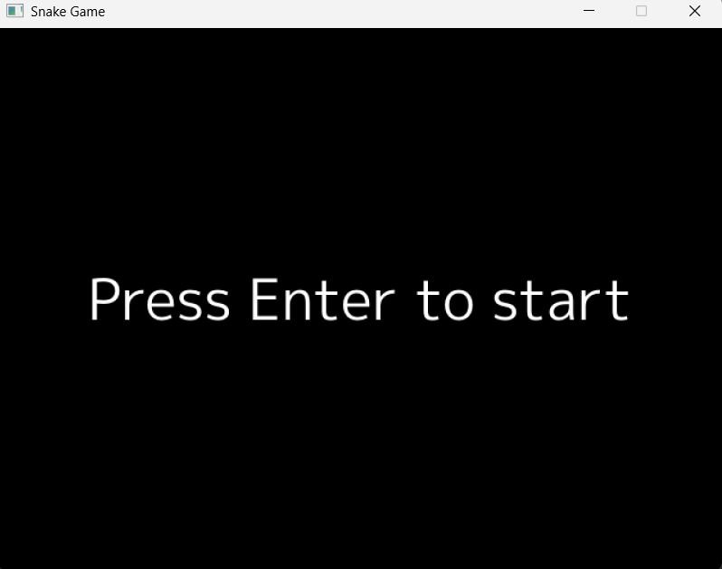
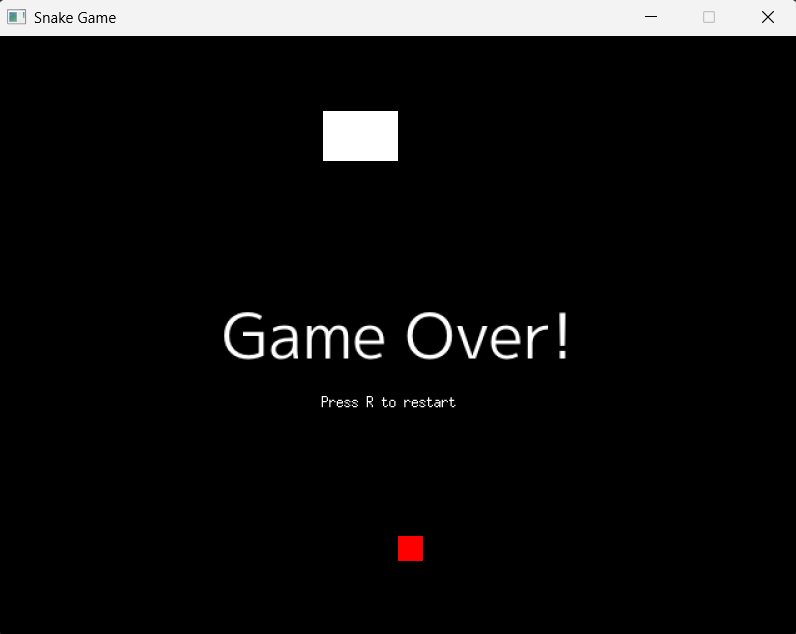
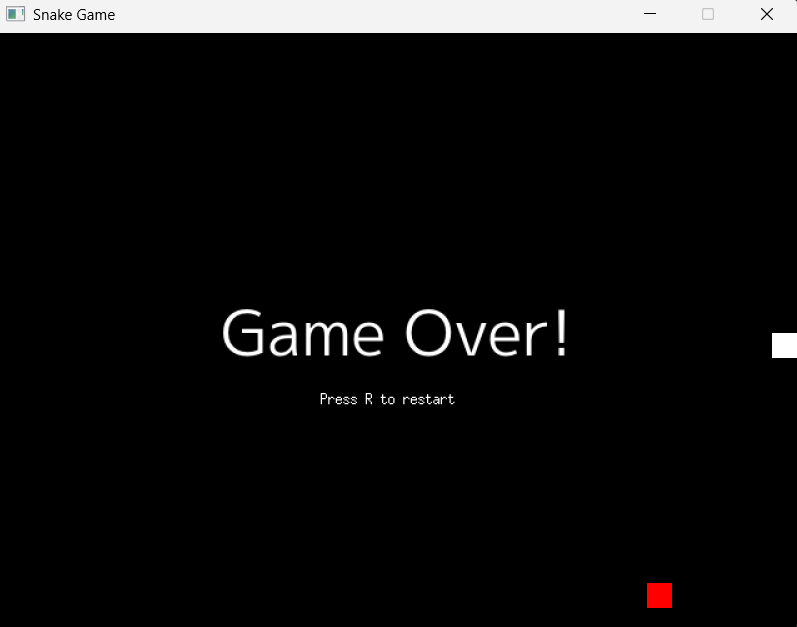

# snake-game

The Snake Game is a classic arcade game implemented in Go using the Ebiten game library. The game features a snake that grows in length as it consumes food, and the objective is to achieve the highest score possible without colliding with the walls or the snake's own body.

## Features

- **Snake Movement**: Control the snake using arrow keys or `W`, `A`, `S`, `D`.
- **Food Mechanics**: Randomly spawning food that increases the snake's length and score.
- **Collision Detection**: Game ends when the snake collides with itself or the walls.
- **Restart Option**: Press `R` to restart the game after it ends.
- **Screenshot Capture**: Press `P` to capture a screenshot of the game.
- **Customizable Settings**: Modify game speed, grid size, and screen dimensions in the code.

## Screenshots

Here are some screenshots of the game in action:

### Gamestart


### Game Over



## Project Structure

- **`main.go`**: Entry point of the application, initializes the game and starts the game loop.
- **`game/`**: Contains the core game logic and components:
  - `snake.go`: Defines the snake's behavior and properties.
  - `food.go`: Handles food spawning and interactions.
  - `game.go`: Implements the game loop, rendering, and input handling.
  - `direction.go`: Defines movement directions.
  - `point.go`: Represents 2D points for positioning.
  - `consts.go`: Contains game constants like screen size and grid size.
- **`images/`**: Stores screenshots captured during gameplay.

## How to Run

1. Clone the repository:
   ```bash
   git clone https://github.com/your-username/snake-game.git
   ```
2. Execute:
   ```bash
   cd snake-game
   go run main.go
   ```

## Dependencies

The project uses the following dependencies:

1. Ebiten: A simple and powerful 2D game library for Go.
2. Go Fonts: For rendering text in the game.